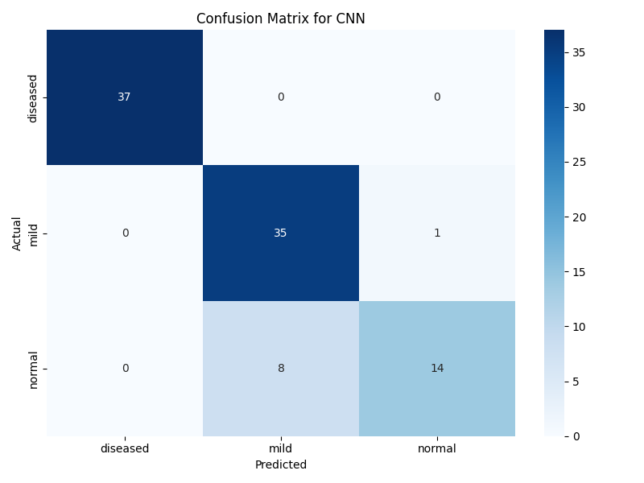
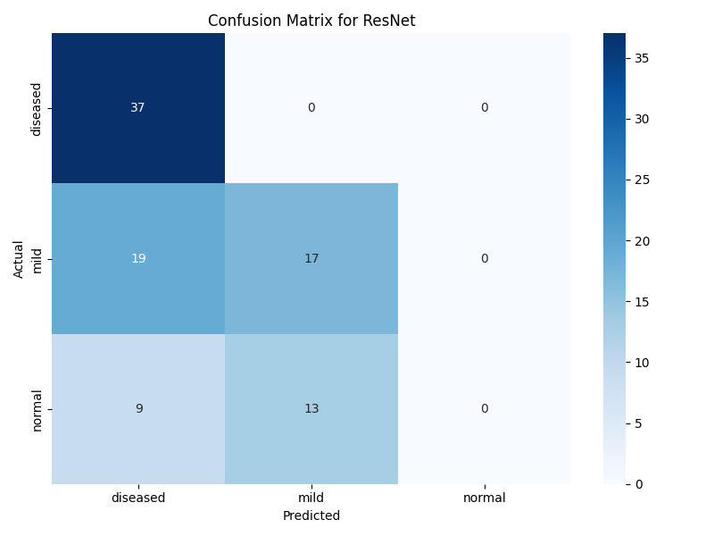
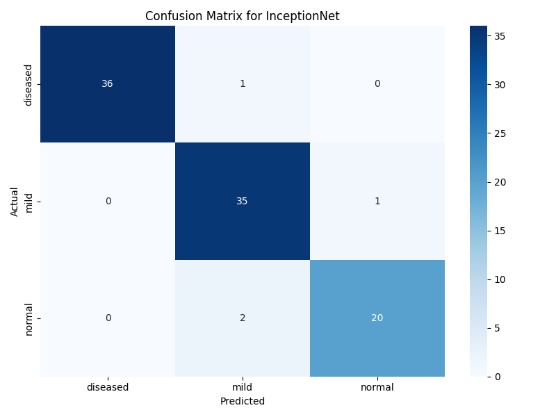
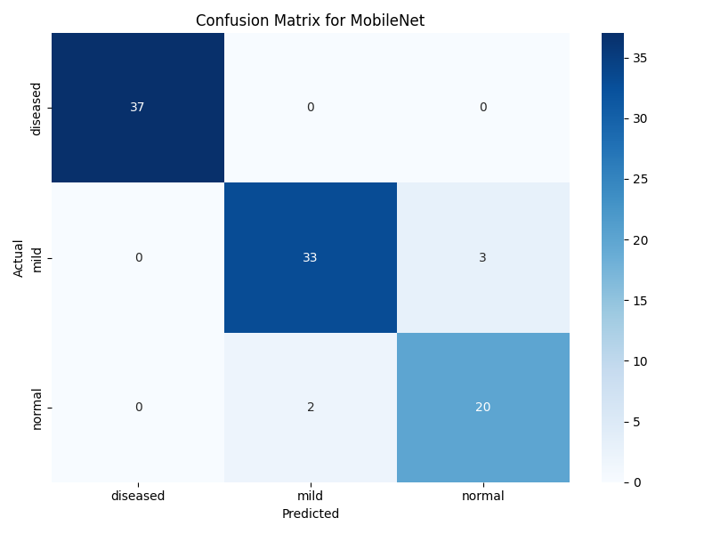
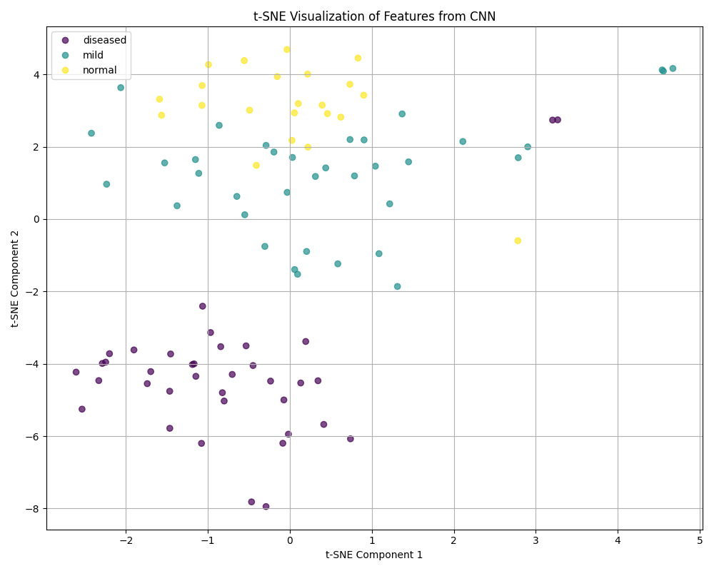
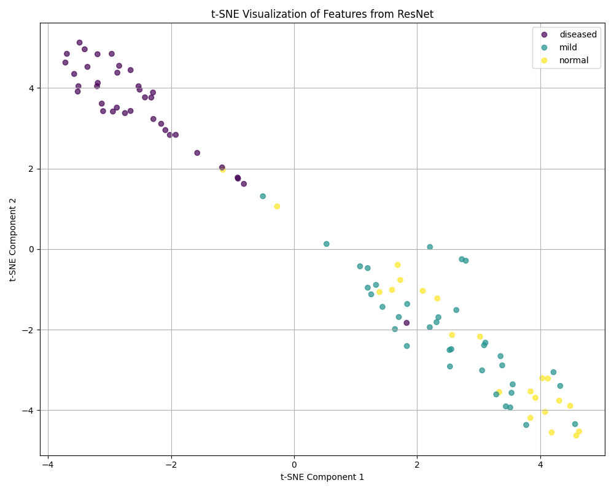
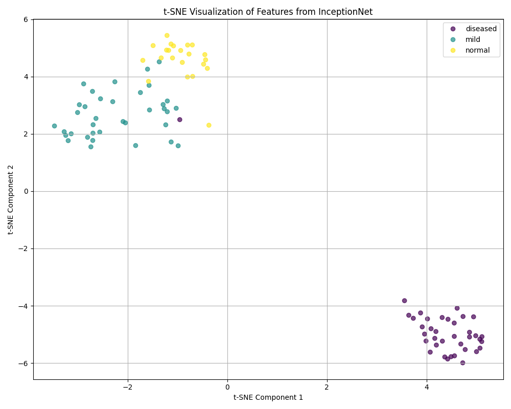
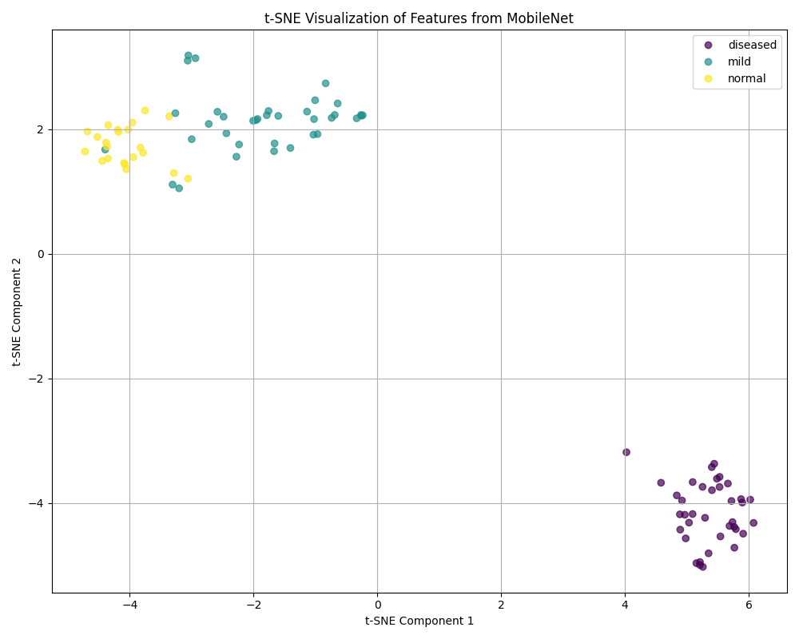

# Arecanut Deep Learning Classifier

## Credits
Based on the original implementation from [Manoharvellala](https://github.com/manoharvellala/ArecaNutImageProcessing). Special thanks to the original authors for their foundational work. This branch extends their work by adding model diversity, data augmentation, deployment UI, and a comprehensive evaluation framework.

## Changes & Improvements

### Dataset Enhancements & Preprocessing
- Balanced dataset across three classes: Diseased, Mild, and Normal.
- Standardized preprocessing: resize to 224×224, RGB conversion, and normalization.

### Data Augmentation
- Introduced augmentations: flips, rotations, shifts, brightness/contrast adjustments to improve generalization.

### Model Architectures
- **CNN**: Custom baseline.
- **ResNet50** – depths that help with vanishing gradients [He et al., 2015].
- **InceptionV3** – multi-scale feature extraction [Szegedy et al., 2015].
- **MobileNetV2** – lightweight, mobile-friendly architecture [Sandler et al., 2018].

### UI Deployment
- Streamlit app for image inference with real-time model comparisons.

### Model Distribution
Trained models available here: [Google Drive Link to Models](https://drive.google.com/drive/folders/14VsIUp9biiiqtkkPYADELhYfsB1Q6WYz?usp=drive_link).


## Model Performance

| Model       | Accuracy (%) | Precision | Recall | F1-Score |
|-------------|--------------|-----------|--------|----------|
| CNN         | 0.9053       | 0.9141    | 0.9053 | 0.9005   |
| ResNet50    | 0.4947       | 0.5519    | 0.4947 | 0.4059   |
| InceptionV3 | 0.9579       | 0.9588    | 0.9579 | 0.9582   |
| MobileNetV2 | 0.9579       | 0.9599    | 0.9579 | 0.9582   |

### Confusion Matrices
<table>
  <tr>
    <td align="center">
      <h3>CNN</h3>
      
    </td>
    <td align="center">
      <h3>ResNet50</h3>
      
    </td>
  </tr>
  <tr>
    <td align="center">
      <h3>InceptionV3</h3>
      
    </td>
    <td align="center">
      <h3>MobileNetV2</h3>
      
    </td>
  </tr>
</table>

### t-SNE Visualizations
<table>
  <tr>
    <td align="center">
      <h3>CNN</h3>
      
    </td>
    <td align="center">
      <h3>ResNet50</h3>
      
    </td>
  </tr>
  <tr>
    <td align="center">
      <h3>InceptionV3</h3>
      
    </td>
    <td align="center">
      <h3>MobileNetV2</h3>
      
    </td>
  </tr>
</table>

## Setup Guide

1. **Clone the repo**
   ```bash
   git clone https://github.com/AbhiKora/Areca-Nut-Disease-Detection-and-Classification.git
   cd Areca-Nut-Disease-Detection-and-Classification
   ```

2. **Conda environment**
   ```bash
   conda env create -f environment.yml
   ```

4. **Download trained models**
   Place `.keras` model files in the models directory from the provided Drive link.

5. **Run the Streamlit UI**
   ```bash
   cd gui
   streamlit run Home.py
   ```

Upload arecanut images to compare model predictions and confidence scores.

## Related Areca Nut Classification Papers
1. **Identification and Categorization of Diseases in Arecanut: A Machine Learning Approach** — Ajit Hegde et al. (2023). Uses CNN & SVM with multiple disease categories and demonstrates conventional ML techniques for areca nut disease classification. *[[ResearchGate](https://ijeecs.iaescore.com/index.php/IJEECS/article/viewFile/32456/17593)]*
2. **Areca Nut Disease Detection Using Image Processing Technology** — Dhanuja K. C. & H.P. Mohan Kumar (2020). Uses texture-based grading and GLCM features with SVM decision trees. *[[ResearchGate](https://www.jetir.org/papers/JETIR2305257.pdf)]*
3. **Detection and Classification of Various Diseases in Arecanut Plantation Using AI/ML** — Shetty et al. (2023). Early-stage detection using image processing and ML pipelines. *[[Peer-reviewed Journal](https://ijarcce.com/wp-content/uploads/2023/05/IJARCCE.2023.125134.pdf)]*
4. **Detection and Prediction of Diseases in Arecanut Plants** — ResNet-based detection of multiple disease types, such as Koleroga and stem bleeding, using RGB and GLCM features. *[[IRJET](https://www.irjet.net/archives/V11/i5/IRJET-V11I572.pdf)]*
5. **Enhancing Areca Nut Detection and Classification Using Faster R-CNN** — Pratama et al. (2025). Uses Faster R-CNN with Haar-like features and integral images to improve mAP and classification metrics. *[[ResearchGate](https://doaj.org/article/49eb75b1fa3946beb777b616a5095812)]*

## Further Research
- **Areca Nut Disease Detection Using CNN and SVM Algorithms** – Balipa et al. (2022). *[[ResearchGate](https://www.researchgate.net/publication/369283554_Arecanut_Disease_Detection_Using_CNN_and_SVM_Algorithms)]*
- **MobileNetV3Small-CM FusionNet: Lightweight Multi-Class Arecanut Disease Classification** – Dinesh S. (2025), combining CNN and handcrafted color descriptors for near-perfect metrics. *[[ResearchGate](https://www.researchgate.net/publication/392174574_MobileNetV3Small-CM_FusionNet_A_Lightweight_Deep_Learning_Framework_for_Multi-Class_Arecanut_Disease_Classification_Using_Feature_Fusion)]*
- **A Hybrid ResNet-50 + Swin Transformer for Arecanut Disease Detection** – SSRG (2025), combining CNN and self-attention for global pattern capture. *[Seventh Sense Research Group]*

## Notes and Future Work
- Transfer learning from ImageNet markedly accelerates training and improves performance.
- Further directions: expand dataset diversity, include mild disease cases, leverage ViT and EfficientNetV2, edge deployment with MobileNet.
- Consider IoT integration for real-time field deployment (ESP32-enabled systems not covered here).
